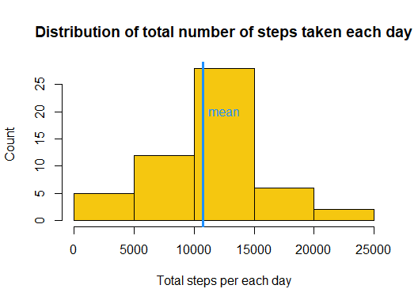
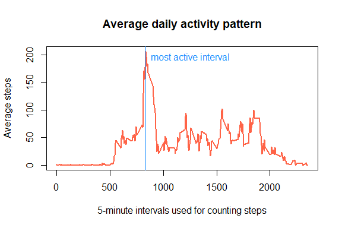
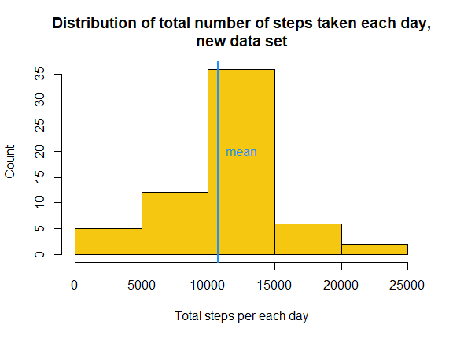
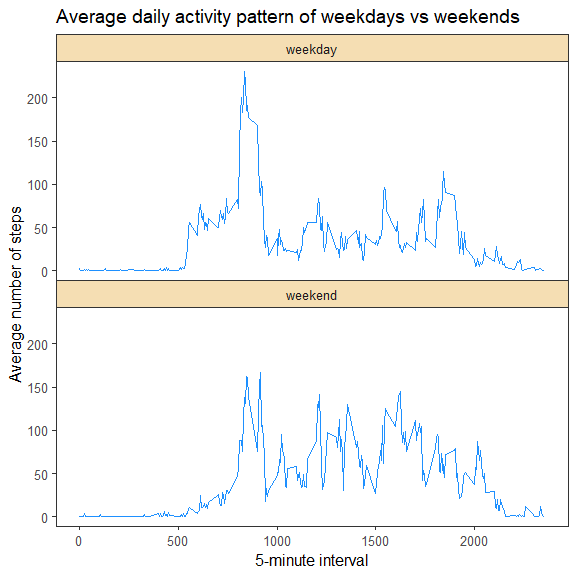

&nbsp;  
&nbsp;  

#### Global settings

```r
library(knitr)
opts_chunk$set(echo=TRUE, cache=TRUE)
```
&nbsp;  
&nbsp;  

## Loading and preprocessing the data

```r
activityData <- read.csv(unzip('activity.zip'))
activityData$date <- as.Date(activityData$date, "%Y-%m-%d")
```
&nbsp;  
&nbsp;  

## What is mean total number of steps taken per day?

```r
stepsPerDay <- aggregate(steps~date, data=activityData, FUN=sum)
meanSPD <- mean(stepsPerDay$steps, na.rm=TRUE)
medianSPD <- median(stepsPerDay$steps, na.rm=TRUE)
```
*Average(mean) steps taken per day*: **10766.19**  
*Median of steps taken per *: **10765**  
&nbsp;  

#### Let's plot a histogram showing distribution of steps taken per day.

```r
with(stepsPerDay, {
        hist(steps, main="Distribution of total number of steps taken each day", 
             ylab="Count", xlab="Total steps per each day", col="#F5C710")
        abline(v=meanSPD, col="dodgerblue1", lwd=3)
        text(12500, 20, "mean",col="dodgerblue1", cex=1)
    }
)
```



&nbsp;  
&nbsp;  

## What is the average daily activity pattern?

```r
stepsPerInterval <- aggregate(steps~interval, data=activityData, FUN=mean, na.rm=TRUE)
maxActiveI <- stepsPerInterval[which.max(stepsPerInterval$steps), "interval"]
maxActiveT <- paste(as.character(as.integer(maxActiveI/60)), as.character(maxActiveI%%60), sep=":")
with(stepsPerInterval, {
        plot(x=interval, y=steps, type="l", main="Average daily activity pattern", 
             lwd=2, col="tomato1", ylab="Average steps",
             xlab="5-minute intervals used for counting steps")
        abline(v=maxActiveI, col="dodgerblue1", lwd=1)
        text(maxActiveI + 50, 190, adj=c(0, 0), "most active interval", col="dodgerblue1", cex=1)
    }
)
```

<!-- -->

#### The 5-minute interval with maximum steps:
The 5-minute interval that, on an average, contains the maximum number of steps is **interval #835**  
Which is the 5 minutes leading to **13:55**.

&nbsp;  
&nbsp;  

## Imputing missing values

```r
incompleteRows <- activityData[!complete.cases(activityData),]
missingValues <- dim(incompleteRows)[1]
# Let us fill the missing values, with the averages for that specific time interval across all days, rounded to the nearest integer. We are rounding to the nearest integer because steps cannot be floats.
# We can use `stepsPerInterval` data frame that we created before.
for(i in 1:nrow(incompleteRows)) {
  row <- incompleteRows[i,]
  incompleteRows$steps[i] <- round(stepsPerInterval[stepsPerInterval$interval == row$interval, "steps"])
  i <= i + 1
}
newActivityData <- rbind(activityData[complete.cases(activityData),], incompleteRows)
newStepsPerDay <- aggregate(steps~date, data=newActivityData, FUN=sum)
newMeanSPD <- mean(newStepsPerDay$steps, na.rm=TRUE)
newMedianSPD <- median(newStepsPerDay$steps, na.rm=TRUE)

df <- data.frame(c(missingValues, 0), c(meanSPD, newMeanSPD), c(newMedianSPD,medianSPD))
rownames(df) <- c("Origianal data", "Modified data")
colnames(df) <- c("missing values", "Mean spd*", "Median spd*")

kable(df, format="html", align=c("c", "c", "c"),
      caption="Comparison of the original and the missing values inputted data sets",
      table.attr = "style='width:500px;border:1px solid;border-width: 1px 0;'"
      )
```

<table style='width:500px;border:1px solid;border-width: 1px 0;'>
<caption>Comparison of the original and the missing values inputted data sets</caption>
 <thead>
  <tr>
   <th style="text-align:left;">   </th>
   <th style="text-align:center;"> missing values </th>
   <th style="text-align:center;"> Mean spd* </th>
   <th style="text-align:center;"> Median spd* </th>
  </tr>
 </thead>
<tbody>
  <tr>
   <td style="text-align:left;"> Origianal data </td>
   <td style="text-align:center;"> 2304 </td>
   <td style="text-align:center;"> 10766.19 </td>
   <td style="text-align:center;"> 10762 </td>
  </tr>
  <tr>
   <td style="text-align:left;"> Modified data </td>
   <td style="text-align:center;"> 0 </td>
   <td style="text-align:center;"> 10765.64 </td>
   <td style="text-align:center;"> 10765 </td>
  </tr>
</tbody>
</table>
\* spd = steps per day  

Based on the data shown in the table above, **the original data set had 2304 missing values**. It appears **inputting missing values does not make a remarkable change** in the average steps per day.
&nbsp;  
&nbsp;  


#### Here is a histogram of average steps taken each day using the modified data

```r
# plot the new data
with(newStepsPerDay, {
        hist(steps, main="Distribution of total number of steps taken each day,\nnew data set", 
             ylab="Count", xlab="Total steps per each day", col="#F5C710")
        abline(v=newMeanSPD, col="dodgerblue1", lwd=3)
        text(12500, 20, "mean",col="dodgerblue1", cex=1)
    }
)
```

<!-- -->

&nbsp;  
&nbsp;  

## Are there differences in activity patterns between weekdays and weekends?

```r
weekenddays <- c("Saturday", "Sunday")
newActivityData$weekend <- as.integer(weekdays(newActivityData$date) %in% weekenddays)
avs <- aggregate(newActivityData$steps, by=list(newActivityData$weekend, newActivityData$interval), FUN=mean)
colnames(avs) <- c("weekend","interval","avsteps")
avs$weekend <- factor(avs$weekend, labels=c("weekday", "weekend"))

# create the panel plots using ggplot
library(ggplot2)
theme_set(theme_bw(12))
ggplot(data=avs, aes(x=interval, y=avsteps), type="l") +
  geom_line(color="dodgerblue1") + facet_wrap(weekend~., nrow= 2, strip.position="top") + 
  labs(x="5-minute interval", y="Average number of steps") +
  ggtitle("Average daily activity pattern of weekdays vs weekends") +
  theme(
    legend.position = "none",
    panel.spacing = unit(0,"cm"),
    panel.grid.major = element_blank(),
    panel.grid.minor = element_blank(),
    strip.placement = "outside",
    strip.background = element_rect(fill="wheat")
  )
```

<!-- -->

Based on the above plot, there appear to be notable differences between the activity patterns 
of weekdays and weekends. Over the weekends, the activity is more evenly distributed throughout the waking part of the day. On the other hand, weekday activity seems to 
concentrate around 2pm.  

&nbsp;  
